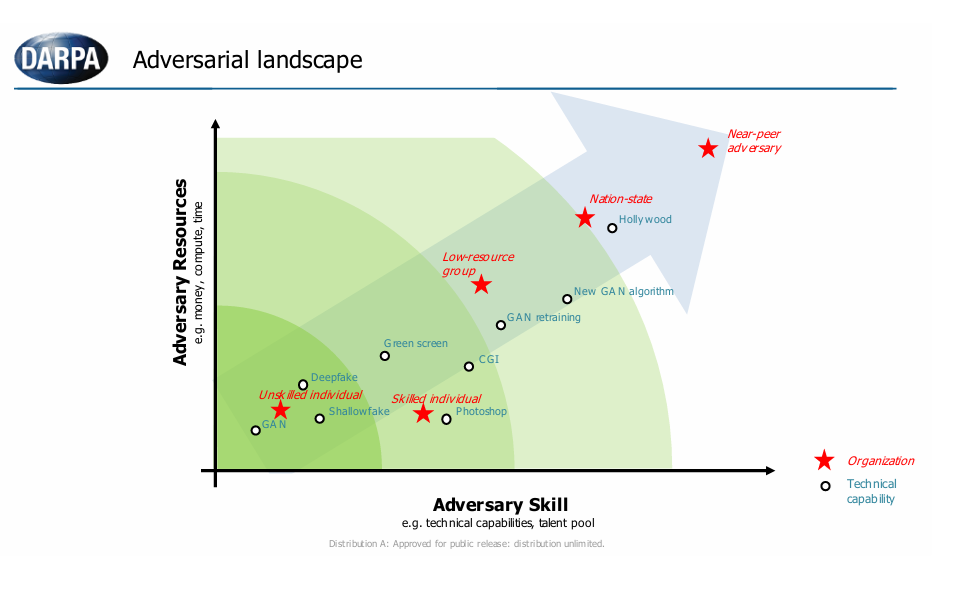
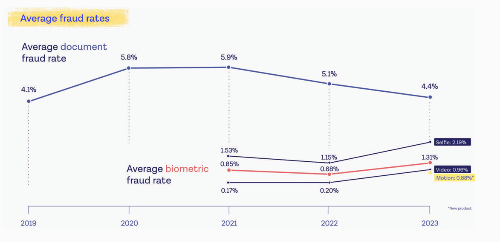
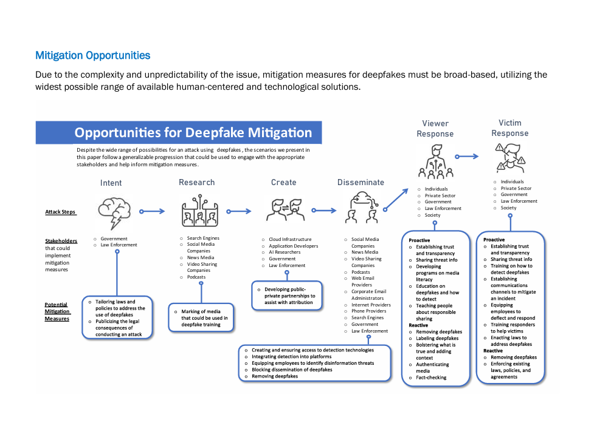

<h1>目次</h1>

${toc}

------------------------------------------------------

# ディープフェイク事象に対する準備と対応に関するガイド

### 第 1.0 版
### 2024 年 10 月

※配布元 = https://genai.owasp.org/resource/guide-for-preparing-and-responding-to-deepfake-events/
※原文 = https://genai.owasp.org/download/41043/?tmstv=1727108189

# ライセンスと使用について

# 概要

ディープフェイク（超リアルなデジタル偽造品）は、生成 AI の急速な発展により、最も目の肥えた視聴者でさえも騙せるほどリアルな動画や音声の作成が容易になったことで、大きな注目を集めています。詐欺師やサイバー犯罪者はディープフェイクを巧妙ななりすましやソーシャル エンジニアリング攻撃に利用できるため、サイバーセキュリティ専門家にとって、ディープフェイクは潜在的に困難な課題となっています。ソーシャル メディアの普及により、CEO などの著名人から一般市民まで、誰もがなりすましの危険にさらされています。わずか 10 秒の音声や動画で、説得力のあるディープフェイクを作成できるからです。ディープフェイクで生成されたコンテンツは、フィッシングや詐欺の手口に既に利用されており、攻撃者は CEO などの著名人の動画を作成し、従業員を操って機密情報の漏洩や資金移動をさせています（Chen & Magramo, 2024 年）。

ディープフェイクはソーシャル エンジニアリングの強力なツールですが、サイバーセキュリティ専門家は、ディープフェイクがもたらすリスクを軽減するために、新しい検出技術や集中的な「ディープフェイクの見分け方」トレーニング プログラムに頼る必要はありません。最近の研究によると、ディープフェイク検出技術はまだ未成熟であり、技術の急速な進歩により、特定の視覚的または音声的アーティファクトの検出に焦点を当てたトレーニング プログラムは急速に時代遅れになるでしょう (GAO, 2024 年)。さらに、研究者たちは、トレーニングを受けても、人々はディープフェイクを確実に検出することはできず、ディープフェイクを識別する能力を過大評価する傾向があることを発見しました (Köbis 他, 2021 年)。他の多くのソーシャル エンジニアリング攻撃と同様に、ディープフェイクを活用した攻撃は、攻撃者の指示により、被害者が確立された手順や制御を回避することを前提としていることがよくあります。従って、このガイドでは、サイバーセキュリティ専門家がディープフェイクに対して取るべき重要なアプローチとして、実用的かつ実践的な多層防御戦略と階層型制御に重点を置いています。

基本的なセキュリティ原則を適用することで、進化するディープフェイクを活用した脅威に耐性のあるガイドを提供することを目指しています。このガイドで推奨されている主要な戦略は次のとおりです。

- 偽造品を視覚的または聴覚的に検知するのではなく、プロセスの遵守に重点を置きます。
- 強力な財務管理と検証手順を導入・維持します。
- 異常な要求に対する認識と懐疑的な姿勢を育む文化を醸成します。
- インシデント対応計画を策定し、定期的に更新します。

このガイドの最初のセクションは「適用範囲」で、主要な定義と対象読者を概説しています。このガイドは、攻撃者の意図に基づいて 4 つの異なるシナリオ（金融詐欺、就職面接詐欺、ソーシャル エンジニアリング、誤情報／偽情報／悪意のある情報）を区別し、NIST SP 800-61 rev.3 に基づくインシデント対応における以下の 4 つの段階に関するガイダンスを提供しています。

1. 準備
2. 検知と分析
3. 封じ込め、根絶、復旧
4. インシデント後の活動

# 適用範囲

人物の肖像を再現することを目的とした合成メディアは、一般的に 2 つのカテゴリーに分類されます（国防総省、2023 年）。

- **チープフェイク** - 機械学習／深層学習を利用せずに操作されたマルチメディアは、多くの場合、より高度な技術と同等の効果を発揮しますが、シャローフェイクまたはチープフェイクと呼ばれることがよくあります。
- **ディープフェイク** - 何らかの機械学習／深層学習（人工知能）を使用して作成（完全合成）または編集（部分合成）されたマルチメディアは、ディープフェイクと呼ばれます。

このガイダンスでは、攻撃者の目的に基づいて、悪意のあるディープフェイクの 4 つのカテゴリーに焦点を当てます。

1. なりすましによる金銭的利益
2. 就職面接詐欺
3. さらなるサイバー攻撃（初期アクセスなど）のためのなりすまし
4. 誤情報／偽情報／悪意のある情報

政府機関や報道機関以外のほとんどの組織は、これら 4 つの目的のいずれかで標的になる可能性があります。公開および非公開の情報源に基づくと、2023 年半ば以降、組織に影響を与えるこれらの 4 つのカテゴリーの活動が、わずかながらも目に見える形で増加していると考えられます。

悪意のあるディープフェイク活動を 4 つのカテゴリーに分類したのは、それぞれに対する準備と対応が異なるためです。例えば、脅威アクターがディープフェイクを詐欺に使用しようとしたり、ヘルプデスクの担当者を騙してアクセスを許可させようとしたりする場合、分析可能な動画や音声をキャプチャできる可能性は低く、コンテンツがプラットフォーム上にホストされることもありません。一方、誤情報／偽情報／悪意のある情報の場合は、分析対象となるメディアが存在し、削除プロセスを実施する必要がある可能性が高くなります。

このガイドは、ディープフェイク事象の 4 つのカテゴリーすべてを網羅する準備ガイダンスを提供していますが、それに続く「検出と分析」、「封じ込め、根絶と復旧」、「インシデント後の活動」のガイダンスは、事象ごとに異なります。

# 準備

準備は、脅威の活動と現在の防御体制の分析を通じて現在のリスクを理解し、ディープフェイクに関するインシデント対応計画を策定し、最後にディープフェイクの報告プロセスと従業員教育を確立することに重点を置いています。

## リスク評価

本稿執筆時点（2024 年 7 月）では、ディープフェイクは、報道機関や政府機関を除くほとんどの組織にとって、詐欺、サイバー脅威活動、または風評被害の主な原因ではありません。とはいえ、公的および民間のサイバー脅威情報源によると、金銭目的の脅威アクターによるディープフェイクやチープフェイクの使用は若干増加しています。技術が進歩するにつれて、広範な攻撃に十分なディープフェイクを作成することがより容易かつ安価になるでしょう（Ciancaglini & Sancho, 2024 年）。ディープフェイク事象への備えとして、組織は、事業、メディア、政治への露出、履歴、脅威アクターの活動、そして詐欺に対する脆弱性に基づいて、ディープフェイクの標的となるリスクを個別に評価する必要があります。

### 脅威アクター

以下に示す、DARPA（Brooks 他, 2022 年）が作成した優れた敵対的状況のグラフは、敵対者のスキル レベルとこれらの技術の使用状況を理解するのに役立ちます。これにより、組織は、どのカテゴリーのディープフェイク技術能力に遭遇する可能性が最も高いかをより適切に判断できるようになります。

*この調査は、Onfido が FIDO アライアンスと共同で作成した 2024 年版アイデンティティ詐欺レポートの調査結果も反映しています。*

生体認証詐欺の増加、そして認証を回避して詐欺を行う手段としてのチープフェイクやディープフェイクの利用が、わずかに増加していることが観察されています。著者らは、この傾向はわずかに増加しており、今後も増加が続くと予想されると結論付けています。従って、サイバーセキュリティ専門家にとって、認識、検知、対応、そして軽減戦略を策定する絶好の機会と言えるでしょう。

### 脅威活動

これらの技術がもたらす現在既知の脅威には、以下が含まれます。

1. 認証の回避 - [How I Broke Into a Bank Account With an AI-Generated](https://www.vice.com/en/article/how-i-broke-into-a-bank-account-with-an-ai-generated-voice/)
2. なりすまし - [Unusual CEO Fraud via Deepfake Audio Steals US$243,000 From UK Company](https://www.trendmicro.com/vinfo/in/security/news/cyber-attacks/unusual-ceo-fraud-via-deepfake-audio-steals-us-243-000-from-u-k-company)
3. 金融詐欺 - [Finance worker pays out $25 million after video call with deepfake ‘chief financial officer’](https://edition.cnn.com/2024/02/04/asia/deepfake-cfo-scam-hong-kong-intl-hnk/index.html)
4. 風評被害 - CEO が不適切な発言や誤った発言をしている、偽物でありながら本物そっくりな動画は、ブランド イメージを損ない、損失につながる可能性があります ([Beware of deepfake of CEO recommending stocks, says India's National Stock Exchange](https://www.reuters.com/technology/cybersecurity/beware-deepfake-ceo-recommending-stocks-says-indias-national-stock-exchange-2024-04-10/))。また、偽の Twitter アカウントがイーライ リリー社とロッキード マーティン社に損失をもたらしています ([Responding to Malicious Corporate Deepfakes – Debevoise Data Blog](https://www.debevoisedatablog.com/2023/01/24/responding-to-malicious-corporate-deepfakes/))。
5. ディープフェイク採用面接 - [Criminals Use Deepfake Videos to Interview for Remote Work](https://www.darkreading.com/cyberattacks-data-breaches/criminals-deepfake-video-interview-remote-work)
6. 偽情報による財務的な影響 - 株価への影響など ([S&P Sheds $500 Billion from Fake Pentagon Explosion](https://www.thestreet.com/technology/s-p-sheds-500-billion-from-fake-pentagon-explosion))

## 防御の評価

評価には、機密データの開示、ヘルプデスク、金融取引、イベント対応という 4 つの主要領域におけるポリシー、手順、施行、監査方法のレビューを含める必要があります。

まず、機密データの開示、合併・買収、法的事項、金融取引、そして承認または身元確認（ヘルプデスク、人事、物理的セキュリティなど）を目的とした従業員の身元確認に関するセキュリティ対策とポリシーを監視するためのガバナンスおよび承認体制のレビューから始めることを推奨します。このレビューの重要な部分として、これらのプロセスを実行している従業員へのインタビューを行い、ポリシーからの逸脱の有無、またその程度を把握することが挙げられます。このレビューから始めることで、ガバナンスおよび承認体制を円滑に進め、変更や態勢強化プロセスを提案できるようになります。

### 人間ベースの認証のベスト プラクティス

理想的には、人間ベースの認証が認められている以下のベスト プラクティスのうち、少なくとも 2 つは活用する必要があります。これらのベスト プラクティスには以下が含まれます。

- 社内インスタント メッセンジャー、追加の電話番号、音声リクエストの確認に使用できる代替メール アドレスやエイリアスなど、ユーザー認証のための追加検証として機能する<u>承認済み通信手段を従業員ディレクトリに維持します</u>。
- <u>代替通信による検証</u>：事前に登録した電話番号に電話をかけ、本人確認とリクエストの確認を行います。
- <u>本日のコード (Code of the Day)</u> - 金融機関でよく導入されているこの方法では、発信者またはリクエスト者は、定期的に更新されるランダムな一意のコードを生成する安全なシステムを参照する必要があります。その名前に反して、Code of the Day は通常 1 日に数回更新され、他の音声認証方法と組み合わせて使用されます。組織によっては、現在のコードにアクセスするために MFA を必要とする安全なアプリケーションを使用しているところもあれば、SMS でコードを配布するところもあります。頻繁な自動ローテーションに加えて、オンデマンドでのローテーションを可能にするために、ユーザーはコードのローテーションをリクエストしたり、コードの侵害の疑いを報告したりできる必要があります。従業員がアプリケーションまたはデバイスに認証してコードを取得できない場合、マネージャーまたは同僚は、（セキュリティが確保されたエリアに入ることで）有効な従業員バッジを確認した後にのみ、直接コードを共有できます。
- <u>カスタムのセキュリティ質問</u>：オンボーディング時に設定、またはサードパーティ用に作成され、暗号化されたストレージに保管されます。信用調査レポート、ソーシャル メディア アカウントから抽出できるデータ、または従業員が日常的に使用するデータ（生年月日、従業員 ID、従業員ログイン名など）は使用しないでください。「母親の旧姓」や「ペットの名前」などの一般的な質問は禁止してください。
- メールを送信するか、事前に登録した電話番号に発信して、<u>発信者の上司または監督者にリクエストの検証を必要とします</u>。

### 金融取引

金融取引に関する以下のベスト　プラクティスが、文書化されたポリシーと手順に明記され、違反があった場合の適用と監査の手段が確保されていることを確実にします。

- 金融取引と統制に関する<u>明確な文書化されたポリシー</u>。
- 職務の分離 (SoD)：<u>重要な機能を分離</u>し、単一の担当者が金融取引のあらゆる側面をコントロールできないようにします。例えば、支払いを承認する担当者と支払いを処理する担当者は別々にし、それぞれが重複のない独立した意思決定／根拠のチェーンを構築して、それぞれの役割を果たすようにします。
- <u>二重承認</u>：重要な取引の承認には、2 人の承認担当者を必要とします。これにより、すべての担当者が監視下でのみ取引を開始および完了できるようになります。
- 取引の承認や機密情報の共有を行う際には、<u>「本日のコード」(Code of the Day)</u> という手法を明示することを検討してください。本日のコードにアクセスするには、双方ともコードを表示するポータルにアクセスする必要があります。
- <u>通信および金融取引処理のすべてのシステムに MFA を導入</u>します。
- <u>MFA で保護されていない</u>手段による承認よび認証を許可する<u>プロセスを特定します</u>。
- <u>人間ベースの認証方法を棚卸し</u>し、ベスト プラクティスをレビューします。
- <u>デュアルバンド通信による検証</u>には、単一の通信チャネルでは実現できない 2 種類の認証を必要とします。例えば、取引は、電子メールまたは電話のみで要求、確認、または承認できないようにする必要があります
- 上記を確実にするために、<u>定期的な監査</u>と定期的なアクセス レビューを実施します。
- 金融取引の<u>コンプライアンス手順において、上級管理職の要求に異議を申し立てるのに十分な裁量権が与えられていることを確実にします</u>。
- 一定の閾値を超える取引には、<u>複数の承認を必要とします</u>。

### ヘルプデスク

- <u>パスワードのリセット、MFA への新規デバイスの登録、および口頭による認証の繰り返し失敗の報告に関する現在のポリシーと手順を確実にします</u>。
- 部門の<u>従業員にインタビューを行い</u>、現在のワークフローを決定します（ワークフローは、文書化されたポリシーまたはプロセスと異なる場合があります）。
- （許可を得た上で）<u>プロセスをテストします</u>。
- ポリシー、手順、および実際の運用における<u>ギャップを特定します</u>。
- <u>MFA で保護されていない</u>手段による<u>承認</u>および認証<u>を許可しているプロセスを特定します</u>。
- <u>人間ベースの認証方法を棚卸し</u>し、ベスト プラクティスをレビューします。

### 採用

- <u>候補者のなりすましや不正行為の疑いを報告するためのプロセスが確立されていること</u>、および、すべての採用担当者と採用マネージャーがこれらの傾向と報告プロセスに関する意識向上トレーニングを受けていること<u>を確実にします</u>。
- <u>新入社員の本人確認プロセスをレビュー</u>します。偽造アイデンティティの検出のため、すべての応募者に対して強化された ID 検証があることを確実にします。
ベスト プラクティスとして、FIDO アライアンス認定の本人確認サービスの利用を検討します。
	- [Get Certified for Face Verification | FIDO Alliance - FIDO Alliance](https://fidoalliance.org/certification/identity-verification/face-verification/get-certified/)
	- [Identity Verification Certification Programs | FIDO - FIDO Alliance](https://fidoalliance.org/certification/identity-verification/)
	- [Battling Deepfakes with Certified Identity Verification | FIDO Alliance - FIDO Alliance](https://fidoalliance.org/battling-deepfakes-with-certified-identity-verification/)
- <u>求人広告には、面接において合理的な配慮は要求に応じて提供される</u>ものの、面接プロセス中の音声や動画の操作は認められない<u>という文言を明記してます</u>。
- <u>面接に招待された候補者には、なりすまし候補者を特定するプロセスがあることを周知します</u>。また、発覚した雇用詐欺はすべて訴追することを伝えます。(Sullivan, 2020)
- <u>異なるチーム メンバーによる一連の面接を実施し、可能であれば、面接の形式（ビデオ、電話、対面）とタイミングを変化させます</u>。
- <u>候補者が面接対象者に選ばれたら、面接のスケジュール設定プロセスにおいて、面接はカメラをオンにし、背景のぼかしや背景幕の使用、音声や動画の操作やフィルタリング、ヘッドフォンの使用は禁止し、画面を共有した状態で実施する必要があることを確実にします</u>。また、この時点で支援技術に関する合理的配慮を要請できることを改めて宣言します。
- 採用チームが、経歴調査、推薦状、履歴書の確認、面接などにおいて、常にベスト プラクティスに従っていることを確認するために、<u>採用プロセス全体をレビューします</u>。

### 機密情報の開示

- <u>機密データ開示に関する現在のポリシーと手順をレビューします</u>。これには、合併・買収、法的取引、財務取引、従業員情報（人事）の開示などが含まれます。
- 部門の<u>従業員にインタビューを行い</u>、現在のワークフローを決定します（ワークフローは、文書化されたポリシーまたはプロセスと異なる場合があります）。
- ポリシー、手順、および実際の運用における<u>ギャップを特定します</u>。
- <u>MFA で保護されていない</u>手段による<u>承認</u>および認証<u>を許可しているプロセスを特定します</u>。
- <u>人間ベースの認証方法を棚卸し</u>し、ベスト プラクティスをレビューします。
- ベスト プラクティスは最新の脅威の状況に応じて頻繁に変更されるため、<u>少なくとも年に 1 回はこれらの手順のレビュー</u>をスケジュールします。

### ブランドの監視

- <u>すべての部門、組織がブランドと評判の監視に活用しているツールとサービスのインベントリを作成します</u>。多くの場合、この監視は複数のチーム（CTI、法務ブランド保護など）によって実施されます。
- <u>監視サービスと監視プラットフォームをレビューし</u>、ディープフェイクのアラートが適用範囲内であるかどうかを判断します。
- 部門がディープフェイクの報告手順について<u>教育とトレーニングを受けていることを確実にします</u>。

### 事象への対応

- <u>ディープフェイクを報告するための現在の仕組み</u>、ディープフェイクに関する最新のガイダンスや啓蒙情報<u>を特定します</u>。
- <u>フォレンジック リテイナーをレビューし</u>、ディープフェイク分析のためのデジタル フォレンジックの専門知識が含まれているかどうか、また、その分析に関するサービス レベル契約（SLA）がどうなっているかを判断します。
- 類似ドメインやその他の著作権侵害に対する<u>削除依頼に組織がどのようなサービスまたは仕組みを使用しているかを判断し</u>、そのサービスまたはプロセスがディープフェイク コンテンツの削除依頼にも対応できるかどうかを確認します（Gesser 他、2023 年）。
- <u>ディープフェイク インシデント対応計画を</u>レビューまたは<u>策定します</u>。

## ディープフェイク インシデント対応計画

リスク評価のフェーズで重要な課題をクリアし、脅威、脅威活動、そして組織に関連するプロセスを理解したので、ディープフェイク インシデント対応計画を策定できます。ディープフェイク インシデント対応計画は、インシデント発生時に役割と責任を明確に定義し、コミュニケーションのテンプレートを用意し、対応方法を理解することが、タイムリーな対応に不可欠となるため、極めて重要です。迅速な対応は、組織にとって以下のメリットをもたらします。

- 風評被害を軽減または低減します。
- 機密情報を保護します。
- 信頼と信用を保全します。
- 財務への影響を最小限に抑えます。
- 法令遵守要件を遵守します。
- 業務継続性を確保します。
- 軽減策を特定し、戦略とプロセスを確実に実施します。

この計画策定に役立つ図表が、国土安全保障省の "Increasing Threat of DeepFake Identities" という文書に掲載されています。軽減策として特定された内容は以下のとおりです。

	

ディープフェイク インシデント対応計画プロセスには、少なくとも以下の内容が必要です（Gesser 他、2022 年）。

- ディープフェイクの脅威に関連するセキュリティ対策とポリシーを監視するための<u>ガバナンス構造を確立します</u>。
- <u>ディープフェイクの監視責任者</u>、アラート プロセス、チャネル、関係者<u>を文書化します</u>。
- <u>ディープフェイクの削除プロセスの責任者</u>、および削除要求が拒否された場合の法的措置など、エスカレーションの実施方法<u>を文書化します</u>。
- 組織は、<u>ディープフェイクが企業や個人への嫌がらせ、復讐、または恐喝を目的とした大規模なキャンペーンの一部であるかどうかを検討する</u>必要があります。インシデント対応計画では、以下の影響を考慮する必要があります（Gesser 他, 2023 年）。
	- 風評被害
	- ランサムウェアやデータ窃盗事象に続く恐喝圧力
	- ハクティビズム／企業活動
	- 金融詐欺
	- 機密情報の漏洩
	- 産業スパイ
	- コンピュータまたはネットワークへの侵入
	- 利害関係者の誤解
	- 株価操作
- <u>ディープフェイク識別技術の導入が必要か、あるいは既存のインシデント対応契約にこの種のフォレンジック分析が含まれているかどうかを判断します</u>。これらの契約の SLA をレビューし、コンテンツが偽物であると検証されたことを公表する前に、その期間が許容できる遅延かどうかを判断します。
- <u>法執行機関</u>の関与<u>に関するプロセスとガバナンスを定義します</u>。
- ディープフェイク インシデント対応計画をテストするための<u>机上演習を実施します</u>。具体的なシナリオの例としては、以下が挙げられます。
	- [Deepfakes and Synthetic Media in the Financial System: Assessing Threat Scenarios - Carnegie Endowment for International Peace](https://carnegieendowment.org/research/2020/07/deepfakes-and-synthetic-media-in-the-financial-system-assessing-threat-scenarios)
	- [Increasing Threat of Deepfake Identities - DHS](https://www.dhs.gov/sites/default/files/publications/increasing_threats_of_deepfake_identities_0.pdf)

明確な役割と責任を定めたら、準備の最終段階として、ディープフェイクを報告するための仕組みを構築し、全従業員を対象とした教育と啓発キャンペーンを実施します。

## 意識向上トレーニング

従業員向けの意識向上トレーニングでは、少なくとも以下の内容を網羅する必要があります。

- ディープフェイクとは何か
- ディープフェイクの標的になっていると思われる場合の対処法
- ディープフェイクの被害に遭った場合の対処法
- ディープフェイクを報告する場所

ディープフェイクに関する意識向上トレーニング用のトレーニング教材は数多く提供されており、音声や動画がフェイクである可能性がある兆候を見抜くよう従業員を教育することに重点を置いています。しかし、このガイダンスでは、既存のガイダンスがどの程度時代遅れになっているかを考慮し、具体的なトレーニング プログラムを導入する前に、その内容を慎重に検討することを強く推奨します。

ディープフェイクに関する現在の意識啓発トレーニングの大半は、従業員にディープフェイクを見分ける方法を教育することに重点を置いています。例えば、唇の動きや手の動きといった動画の欠陥や、異常な間といった音声のアーティファクトを見分けるためのガイダンスなどです。しかし、これは人間があらゆるケースで本物と偽物を見分けることができると信じ込ませるトレーニングであり、この技術が高度化するにつれて、こうしたガイダンスは専門知識と安心感という誤った認識を与えるだけになるでしょう。研究者たちは、トレーニングを受けても、人々はディープフェイクを確実に見分けることはできず、ディープフェイクを見分ける能力を過大評価する傾向があることを発見しました（Köbis 他, 2021 年）。動画や音声がどれほど完璧であっても、従業員が財務管理や手順を回避するよう圧力をかけられてもその管理や手順に従うようにトレーニングすることが望ましいのではないでしょうか。

さらに、ディープフェイクは完璧でなくても効果を発揮します。詐欺師は通常、人間の心理を悪用し、緊急かつプレッシャーのかかるシナリオを用いて恐怖とパニックを煽り、標的者に軽率な行動を取らせようとするからです。音声や動画生成の専門家ではない従業員に、権威ある人物からかけられたように見える緊張感のある電話やプレッシャーのかかる依頼の際に、潜在的な証拠となるアーティファクトや矛盾点を常に注意深く監視するよう求めるのは、過剰な期待に思えます。アクセス取得を目的とした詐欺行為やソーシャル エンジニアリングの実行においてディープフェイク攻撃が成功した場合、これらはほぼ普遍的な例であり、標的が既存の手順を回避させられた例であり、偽造の巧妙さとは無関係です。従って、多層防御と階層化された管理策は、ディープフェイク ソーシャル エンジニアリングによる最悪の影響を軽減・防止するための重要な戦略です。

さらに、ディープフェイクによく見られるようなアーティファクトを引き起こす可能性のある、無害なビデオ通話ツールも数多く存在します。NVIDIA にはそのようなツールが複数あり、例えば、ブロードキャスト ツールの 1 つの機能は、実際にはカメラとアイ コンタクトしていないにもかかわらず、常にカメラとアイコンタクトしているように見せます。こうしたツールの多くは、障害者向けの配慮や、単に生活の質を向上させるためのものである可能性があり、全面的に禁止することは考えにくいでしょう。イースト アングリア大学のサイバーセキュリティ教授であるオリ バックリー氏をはじめとする専門家は、組織はこうしたアプローチではなく、考え方を変えるべきだと提言しています。「最近では、自分の目で見たものだけを信じることはできません。見る動画や受ける通話について、もう少し広い視野で考えるべきです。ディープフェイクやこのような詐欺に対処する上で最も重要なのは、批判的思考力です」(Hughes, 2023 年)。

従って、トレーニングでは以下の点を推奨します。
- <u>将来を見据えた教育ガイダンスを実施し、従業員が「本物の」音声や動画を見分ける専門知識を持っていると誤って思い込んでしまうことを防ぎます</u>。これには、従業員の目や耳は信頼できないことを強調することが含まれます。従って、例外なくすべてのケースにおいて適切なプロセスに従う必要があります。
- <u>ディープフェイクは、恐怖などの強い感情を喚起することで行動を起こさせるように設計されており</u>、しばしばプレッシャーや緊急感を伴って提示されます。これは扁桃体ハックと呼ばれ、通常の論理的思考を覆し、要求の異常性について考える時間もないうちに行動を起こさせてしまいます（Rowles, 2023 年）。
- 上級管理職からの認証済み会議プラットフォームから他の会議テクノロジーへの移行要請については、たとえ「接続の問題」を理由に「説明」された場合でも、あるいは WhatsApp メッセージなどの通常とは異なるソースから発信された要請であっても、<u>従業員は、上級管理職からの困難な要求について、繰り返し強化されたガイダンスを聞き知っている必要があります</u>。
- <u>全従業員に対し、通常とは異なるリクエストについては</u>、別のチャネルで連絡を取るよう依頼することで<u>検証する権限と奨励を与えていることを改めて周知徹底します</u>。メールでのリクエストは、既知の信頼できる電話番号に電話をかけて検証する必要があります。ビデオ通話でのリクエストは、メールなどで検証することができます。
- <u>ディープフェイクの疑いがある場合の対処法</u>と報告先<u>について、従業員にガイダンスを提供します</u>。これには、電話会議で「録音」ボタンを押す、関連する連絡先情報（メールアドレス、電話番号、使用したアプリ）を記録する、リクエストの内容（使用した会社名、金額、銀行口座）をメモするなどのガイダンスが含まれます。
- <u>すべての会議で</u>、ユーザーが参加する前に<u>検証を求める慣行を標準化し、周知徹底します</u>。
- <u>ディープフェイク教育のアプローチには、従業員のフィッシング対策強化に一般的に用いられる手法と同様の手法を取り入れることを推奨します</u>。これには、しばしば議論の的となるものの、ディープフェイク シミュレーションを実施して従業員の認識と手順の有効性をテストすることも含まれます (Francey, 2024 年)。これには以下のものが含まれます。
	- 電話やビデオ会議で幹部になりすますディープフェイク音声またはディープフェイク動画
	- ソーシャル メディア プロフィールをディープフェイクすることによる従業員とのつながりの試行
	- ディープフェイク コンテンツを含むフィッシング メールまたはメッセージの従業員への送信

# 事象固有のガイダンス

このセクションでは、最も一般的な3種類のディープフェイク事象について、検出と分析、封じ込め、根絶、復旧、インシデント後の活動に関する具体的なガイダンスを提供します。

## なりすまし詐欺による金銭獲得

これらの事象では、通常、上級管理職の従業員、または合併・買収（M&A）、訴訟和解金、金融取引に関与する従業員になりすまします。脅威アクターは、これらのディープフェイクを使用して、会社の経営陣からの極めて緊急かつ極秘の依頼を装い、従業員を騙して資金を送金させたり、機密情報を共有させたりします。

### 検知と分析

- 金融取引に関する<u>コンプライアンス手順をレビューし</u>、上級管理職の要求に異議を申し立てる際の裁量を拡大します。
- <u>ディープフェイクの報告手順と教育資料をレビューし</u>、金融取引に関わる従業員に報告の仕組みを周知徹底します。
- <u>職務分離と二重承認を確保するためのプロセスをレビューし</u>、このプロセスに従わない例外を自動的に特定する方法を判断します。
- 組織内で<u>第三者が銀行口座または支払い情報を更新する</u>平均的な<u>頻度を特定し</u>、限られた期間内に支払い口座または支払い方法への異常な変更回数をアラートで検知できるようにします。例えば、保険会社がプロバイダーに対し、支払い口座を平均して年に 3 回更新することが洋装される場合、1 ヶ月に 3 回の口座変更はアラートを発動し、要求内容をレビューする必要があります。
- <u>ディープフェイクを受けた個人にできるだけ早くインタビューし</u>、その事象と要求内容について覚えている詳細や書き留めている可能性のある情報を尋ねます。ソーシャル メディア、個人的な電話、その他企業活動以外での活動など、事象発生前に何か異常なコミュニケーションがあったかどうかを尋ねます。
- <u>事象を詳細に記録します</u>。この記録は、社内調査、法的手続き、保険金請求など、将来の参考資料として重要になる場合があります。詳細な記録には、氏名、日時、および以下の情報が含まれていることを確実にします（Francey, 2024 年）。
	- 詐欺または試行の初期の発見
	- 脅威アクターとのすべての通信
	- 金融機関や当局への通知のために講じた措置
	- 影響を受けたシステムおよびアカウントを隔離するために講じた措置

#### 一般的な TTP

- 手法: 被害者情報の収集
	- 戦術：偵察
	- 関連する ATT&CK TTP：
		- T1589.003 - 被害者のアイデンティティ情報の収集：従業員名
		- T1591.004 - 被害者の組織情報の収集：役割の特定
		- T1593.001 - 公開ウェブサイト／ドメインの検索：ソーシャル メディア検索
		- T1593.002 - 公開ウェブサイト／ドメインの検索：検索エンジン
		- T1594 - 被害者所有ウェブサイトの検索
	- 説明：
		- 攻撃者は、標的を絞る際に利用可能な被害者のアイデンティティを収集する可能性があります。アイデンティティには、従業員名、連絡先、部署名、事業内容、関係性、発表内容、役割と責任など、さまざまな詳細が含まれる可能性があります。
金融詐欺を引き起こすディープフェイク インシデントでは、攻撃者は通常、2 つのペルソナを引き出し、両方の情報を収集します。つまり、1 人は取引を指示する絶対的な権限を持つ人物で、もう 1 人は実行権限を持つ人物であり、後者が被害に遭うのが一般的です。被害者は、中間管理職や金融取引の実行または承認権限を持つ個人であることが多いです。
攻撃者は、オンラインやその他のアクセス可能なデータ セット（ソーシャルメディア、被害者所有のウェブサイトの検索など）を通じて公開される情報など、さまざまな方法でこの情報を収集する可能性があります。
- 手法：被害者のアーティファクトの収集
	- 戦術：偵察
	- 関連する ATT&CK TTP：
		- T1593.001 - 公開ウェブサイト／ドメインの検索：ソーシャル メディア検索
		- T1593.002 - 公開ウェブサイト／ドメインの検索：検索エンジン
		- T1594 - 被害者所有ウェブサイトの検索
	- 説明：
		- 攻撃者は、従業員のアーティファクト（公開されている本人の画像、音声、動画クリップなど）を収集し、後にディープフェイクの作成に利用することがあります。これらのアーティファクトは通常、金融取引を開始する権限を持つペルソナのために収集されます。攻撃者は、ソーシャル メディア、検索エンジン、または被害者所有ウェブサイトからこれらの情報を収集する可能性があります。
- 手法：追跡不可能な金融口座の取得
	- 戦術：リソース開発
	- 関連する ATT&CK TTP：
		- T1583：インフラストラクチャの取得
	- 説明：
		- 攻撃者は、追跡不可能な金融口座を作成するか、既存の口座を利用して不正な金融取引によって発生した資金を回収する可能性があります。
- 手法：ディープフェイク モデルの開発
	- 戦術：リソース開発
	- 関連する ATT&CK TTP：
		- T1587.004：開発能力：エクスプロイト
	- 説明：
		- 攻撃者は、事前に収集したアーティファクトを用いて、被害者の声や表情などの個人的特徴を模倣する機械学習モデルを作成する可能性があります。これらのモデルは、ゼロから構築することも、AI 音声クローン ツール、ボイスチェンジャー ソフトウェア、ディープフェイク動画ツールを使用することもできます。また、これらのソフトウェアをサービスとしてサブスクリプションすることで、モデルを迅速に開発することも可能です。攻撃者は、被害者のリアルタイムまたはオフラインの音声・動画クローンを作成する前に、音声合成などの技術を用いてモデルをテストします。
- 手法：被害者への接触の開始
	- 戦術：初期アクセス
	- 関連する MITRE ATT&CK/ATLAS TTP：
		- AML.T0052 / T1566 フィッシング
		- T1585.001：アカウントの確立：ソーシャル メディア アカウント
	- 説明：
		- 非標準チャネル、または正規のチャネルで偽装された音声またはビデオ通話を介して接触を開始しますが、技術的な問題に関する苦情を述べ、会話の残りの部分を非標準チャネルに移すよう要求します。これには、WhatsApp、LinkedIn　のインスタント　メッセージ、テキスト　メッセージ、電話（場合によっては偽装番号からの通話）が含まれます。音声メッセージには、発信者が事前に用意した台本を用意しているように見せかけられます。これにより、多くの場合、標的は　WhatsApp　などの企業が管理していない通信チャネルに連絡したり、フォローアップを求めたりします。
- 手法：被害者の誘導と指示の実行
	- 戦術：実行
	- 関連する MITRE ATT&CK TTP：
		- T1204：ユーザーによる実行
	- 説明：
		- 攻撃者は、ビジネス要件の緊急性を利用して、被害者に不正な取引を開始させようとします。この要件は、偵察段階で収集されたビジネス アナウンスメントや関係性データに基づいて、悪意を持って作成される可能性があります。標的に対して、緊急性と機密性の必要性を強調します。これは、標的が SoD（職務の分離）および二重承認プロセスを強制的に回避することを目的としています。
- 手法：既存のセキュリティ管理策の回避
	- 戦術：防御の回避
	- 関連する MITRE ATT&CK/ATLAS TTP
		- T1656：なりすまし
		- T1036：マスカレード
		- T1078：有効なアカウント
		- AML.T0015：ML モデルの回避
	- 説明：
		- 攻撃者は、生成されたディープ フェイクの音声または動画が従来のセキュリティ ソリューションでは検出できないような ML モデルを作成する可能性があります。また、ディープフェイクに対して ML ベースの検出ツールが運用されている場合、攻撃者はモデル回避手法を使用する可能性があります。
- 手法：ディープフェイクによる資金流用と財務への影響
	- 戦術：情報流出と影響
	- 関連するMITRE ATT&CK TTP
		- T1657 - 金融窃盗
	- 説明：
		- ソーシャル エンジニアリングが成功すると、被害者は騙されて攻撃者が管理する金融口座に送金させられる可能性があります。被害者は、要求された資金を攻撃者が所有する追跡不可能な金融口座に流用することで、金融取引を完了します。

### 封じ込め、根絶、復旧

1. 金融取引が完了している場合は、<u>関係する両方の金融機関に直ちに連絡し、詐欺行為を報告します</u>。ここでの迅速な報告が、資金回収の可能性を高める鍵となります。
2. 脅威アクターから金融口座が提供されたにもかかわらず、取引が完了していない場合は、<u>その口座が詐欺に使用されている可能性があることを金融機関に直ちに通知します</u>。
3. ディープフェイクの要求を受けた標的から提供された情報に基づき、キーワード検索を行い、<u>類似の文言</u>やメッセージ<u>を含むフィッシング メールを検索します</u>。
4. <u>同様の権限やアクセス権限を持つ他の従業員が標的にされていないか、積極的に調査します</u>。
5. <u>ディープフェイクの対象者に連絡し、個人アカウントやソーシャル メディアに異常な活動がないか確認するよう依頼します</u>。例えば、ソーシャル エンジニアリングの試み、メディア コンテンツへのアクセスを要求した可能性のある最近の偽アカウント、嫌がらせの証拠などです。
6. <u>ディープフェイクの対象者の活動を調査し</u>、アカウントやメールに異常なアラートがないか確認します。

### インシデント後の活動

1. 財務部門と共に、標的とされたディープフェイクの対象者または不正アカウントが関与する、最近要求された未<u>遂取引または不正な取引についてレビューします</u>。
2. ベンダーに対する異常に高額または少額の支払い、異常に頻繁な支払い、アカウントに関する電話や質問の件数の異常な増加など、<u>当該事業が発生した後 90 日以内の金融取引における統計的な異常をレビューします</u>。
3. <u>当該事象中に発生した標準手順からの逸脱をレビューし</u>、警告または検出機構に欠陥がなかったかどうかを判断し、今後の対応とセキュリティ対策を改善するために警告または検出機構を改良します。
4. <u>金融取引のリクエストの認証要求または承認のプロセスの更新が必要かどうかを判断します</u>。

## サイバー攻撃を目的としたなりすまし

通常、ディープフェイクは新しいアカウントの作成や既存のアカウントの乗っ取りに使用されます。脅威アクターは、ソーシャル エンジニアリングの実行、認証や生体認証のバイパス、あるいは他のサイバー脅威活動に先立つ標的の更なる偵察にディープフェイクを使用していると報告されています。

### 検知と分析

1. これらの試みの検知は、<u>ヘルプデスクが適切なトレーニングを受け</u>、なりすましの疑いのあるイベントを報告するための<u>特別な報告の仕組みを備えている</u>かどうかにほぼ依存します。ディープフェイクの報告手順と教育資料を見直し、金融取引に関わる従業員に報告の仕組みを周知徹底します。
2. IP アドレスの位置情報、実際の場所でのバッジのスワイプ、異常なメール ルーティングなどを比較することで、<u>あり得ない移動を伴うと思われるリクエストに対するアラートを作成します</u>。
3. <u>各ユーザーが一般的に使用していると思われるデバイスのデバイス フィンガープリンティングを比較するアラートを作成します</u>。新規または認識されていないデバイスからのログインまたはリクエストには、追加の検証手順を実行する必要があります。
4. <u>ヘルプデスクのサービス チケット ログを Splunk などの分析プラットフォームに取り込み</u>、ユーザー リクエストの<u>異常な急増</u>、認証リセットの大幅な急増、既知のユーザー所在地での異常な連絡時間など<u>を検出します</u>。
5. <u>ディープフェイクを受けた個人にできるだけ早くインタビューし</u>、イベントとリクエストの内容について覚えている詳細やメモを取っている情報を尋ねます。
6. <u>インシデントを詳細に記録します</u>。この記録は、社内調査、法的手続き、保険金請求など、将来の参考資料として重要となる可能性があります。詳細な記録には、以下の項目を含む氏名、日時が含まれていることを確実にします（Francey, 2024 年）。
	- a. なりすましまたは偽装の試みが最初に発見された日時
	- b. 脅威アクターとのすべての通信
	- c. 影響を受けたシステムとアカウントを隔離するために講じた措置

#### 一般的な TTP

- 手法：被害者情報の収集
	- 戦術：偵察
	- 関連する MITRE ATT&CK/ATLAS TTP：
		- 「なりすましによる詐欺による金銭取得」のセクションを参照
		- T1592：被害者ホスト情報の収集
		- T1590：被害者ネットワーク情報の収集
		- T1597：クローズド ソースの検索
	- 説明：
		- 「なりすましによる詐欺による金銭取得のセクションの手順を参照。さらに、攻撃者はヘルプデスクに関する情報や、使用する可能性のあるペルソナの秘密の質問への回答を収集する可能性があります。また、エンドポイントのオペレーティング システム、内部ネットワーク情報、アプリケーション情報など、被害者の環境に関する情報も収集されるため、攻撃者は実行指示を出しやすくなります。
		- 被害者は、上級管理職になりすました人物が乗っ取ったヘルプデスクの場合もあれば、上司になりすました人物に乗っ取られた従業員である場合考えられます。
手法：被害者のアーティファクトの収集
	- 詳細は「なりすまし詐欺による金銭取得」を参照。
- 手法：ディープフェイクモデルを開発する
	- 詳細は「なりすまし詐欺による金銭取得」を参照。
- 手法：被害者への接触の開始
	- 戦術：初期アクセス
	- 関連する MITRE ATT&CK/ATLAS TTP：
		- AML.T0052 / T1566 フィッシング
		- T1585.001：アカウントの確立：ソーシャル メディア アカウント
	- 説明：
		- 「なりすまし詐欺による金銭主億」セクションの手順を参照。さらに、攻撃者は組織内のさまざまなサービス デスクに接続し、偽造された音声や動画を使用してエージェントを誘導し、悪意のある行為を行わせる可能性があります。例：ディープフェイクのコンテンツをプロフィール写真に合成し、人間による検証を通過させることも選択肢の1つです。その他のケースでは、非標準のチャネルを使用して、偽造コンテンツが、特権を持つ従業員に有害な行為をさせようとする上司を装うために使用される可能性があります。
- 手法：社内の技術情報の収集
	- 戦術：探索
	- 関連する MITRE ATT&CK/ATLAS TTP：
		- T1087：アカウントの探索
		- T1217：ブラウザ情報の探索
		- T1652：デバイス ドライバの探索
		- T1057：プロセスの探索
		- T1012：レジストリ クエリ
		- T1518：ソフトウェアの発見
		- T1082：システム情報の探索
		- T1614：システムのロケーションの探索
		- T1016：システムのネットワーク構成の探索
		- T1049：システムのネットワーク接続の探索
	- 説明：
		- 攻撃者は、最初の接触を利用して、被害者が使用しているシステムについてさらに詳しく調べ、さらにエクスプロイトを作成し、システムへの最初のアクセスを取得する可能性があります。多くの場合、情報は偽の音声やビデオ、被害者への質問、または被害者に特定のコマンドを実行させることによって収集されます。セッションを長く維持できないため、攻撃者は、この段階では、ネットワークのラテラル ムーブメントのための検出などの複雑なタスクの実行を制限する可能性があります。
- 手法：被害者のシステムへの初期アクセス
	- 戦術：初期アクセス
	- 関連する MITRE ATT&CK/ATLAS TTP：
		- T1189：ドライブ バイ攻撃
		- T1133：外部リモート サービス
		- T1200：ハードウェアの追加
		- T1566：フィッシング
		- T1091：リムーバブル メディアを介した複製
		- T1078：有効なアカウント
	- 説明：
		- 攻撃者は収集した情報に基づいてエクスプロイトを使用し、ディープフェイク技術を用いて被害者にシステム内でエクスプロイトを実行させることで、システムへの継続的なリモート アクセスを実現する可能性があります。攻撃手法としては、悪意のある添付ファイルを公式または個人のメールアドレスに送信したり、ユーザーを騙して悪意のあるリンクをクリックさせ、ドライブ バイ攻撃の手法を用いたり、あるいはユーザーに事前に送付された悪意のあるハードウェアやメディア デバイスを接続させたりすることが考えられます。

注：今後、攻撃者は、企業向けにリストされている通常の ATT&CK TTP を用いて攻撃サイクルを進展させる可能性があります。

### 封じ込め、根絶、復旧

1. <u>なりすまし被害に遭った従業員に連絡を取り</u>、最近のヘルプデスク リクエストをすべて確認し、無効なリクエストを特定します。
2. <u>なりすまし被害に遭った従業員に、多要素認証（MFA）に登録されているデバイスを確認するよう依頼します</u>。身元不明のデバイスが登録されている場合は、モバイル デバイス管理（MDM）または MFA 管理システムから削除する前に、フォレンジック調査のためにそのデバイスのすべての詳細情報を保存します。
3. <u>同様の権限またはアクセス権限を持つ他の従業員が標的にされていないか、積極的に調査します</u>。同様の期間内のヘルプデスクの通話記録とチケットをレビューし、時間、部署、地域、リクエストの種類に基づいて、異常な傾向やクラスターがないか確認します。
4. <u>標的の OSINT/ソーシャル メディアのレビューを実施します。これにより、レビューすべき追加情報を特定し、キャンペーンのタイムラインを作成するのに役立ちます。</u>調査を行う際には、なりすまし犯が共有した詳細情報の完全なリストを、調査対象に含めるようにします。これには、ニックネーム、通称、役職、部署、直属の上司、従業員 ID など、脅威アクターの潜在的な偵察情報源の特定に役立つ情報が含まれる場合があります。少なくとも、ビジネス インテリジェンスやセールス リードのための OSINT 情報源を含める必要があります。例えば、以下の情報です。
	- [LinkedIn](https://www.linkedin.com/)（プロフィール、最近の投稿とコメント、対象者が組織内で誰と繋がっているか、役職と部署がどのように参照されているかを確認）
	- [Rocketreach.co](https://rocketreach.co/)
	- [Lusha.com](https://www.lusha.com/)
	- [Uplead.com](https://www.uplead.com/)
	- [DNB.com](https://www.dnb.com/)
	- [Apollo.io](https://apollo.io/)

	その他、ソーシャル メディア サイトやメンションを発見するのに役立つ無料の OSINT ツールも活用できます。例えば、以下のツールです。

	- [grep.app](https://grep.app/)
	- [OSINT Framework](https://osintframework.com/)
	- [IntelligenceX](https://intelx.io/)
	- [Social Searcher](https://www.social-searcher.com/)
	- [The Harvester](https://github.com/laramies/theHarvester)

	OSINT 演習の目的は、以下のとおりです。

	- 脅威アクターがソーシャル エンジニアリングの詳細をどこで入手しているかを把握します。
	- 組織内でソーシャル エンジニアリングの標的となり得る他の標的を特定し、さらなる脅威ハンティングを行います。
	- 従業員に関する漏洩情報に関連する認証プロセスをレビューし、脆弱性を特定します。例えば、従業員 ID が GitHub で公開されている場合、認証には使用してはなりません。
5. <u>標的の認証情報が、最近のデータ漏洩や侵害</u>（スティーラー ログ、[haveibeenpwned](https://haveibeenpwned.com/) など）<u>に含まれていたかどうかを判定します</u>。スティーラー ログが見つかった場合は、スティーラー ログのエントリ全体（これには、高度なソーシャル エンジニアリングの機会を提供する可能性のある自動入力情報やチャレンジ質問への回答を含みます）をレビューします。なりすましの従業員に発見事項を通知し、これらの情報を使用してパスワード リセットを実行する可能性のある非企業アカウントを保護できるようにします。
6. <u>提供された身分証明書を、合成 ID の可能性がないかをレビューします</u>。発見事項があれば、なりすましの被害を受けた従業員に通知します。
7. <u>恐喝、脅迫、嫌がらせ</u>、またはなりすまし犯による認証やソーシャル エンジニアリングの継続につながる可能性のある機密情報の<u>開示がないか、アカウントをレビューします</u>。

### インシデント後の活動

1. 従業員意識向上トレーニング用の<u>ディープフェイク シミュレーションを次回作成する際には、同じ情報源を参照することを検討します</u>。
2. インシデント後のレビューを実施し、セキュリティ管理と対応手順の<u>改善点を特定します</u>。

## 就職面接詐欺

## 誤情報／偽情報／悪意のある情報

# まとめ

このガイドで述べてきたように、ディープフェイク技術を取り巻く状況は急速に進化しています。ディープフェイクの生成と検出はどちらも驚異的なペースで進歩しており、サイバーセキュリティの専門家や組織にとって、常に変化し続ける課題となっています。これらの技術がどのように発展していくかを確実に予測することは不可能ですが、本書で提供されるガイダンスは、長期的な視点に立って作成されています。

OWASP のアプローチは、技術の進歩に関わらず、今後も重要であり続ける可能性が高い基本原則とベスト プラクティスに焦点を当てています。批判的思考、堅牢な認証プロセス、そして多層的なセキュリティ管理を重視することで、OWASP は、ディープフェイク技術の将来の発展に適応できるフレームワークの構築を目指しました。

ガイダンスの主要な側面は以下のとおりです。

- 偽造物の視覚的または聴覚的な検出ではなく、プロセスの遵守に重点を置きます
- 強力な財務管理と検証手順を導入・維持します。
- 通常とは異なる要求に対する認識と懐疑的な姿勢を育みます。
- インシデント対応計画を策定し、定期的に更新します。

これらの要素は、進化する脅威に対して耐性を持つように設計されています。これらは、時代遅れになる可能性のある特定の技術的ソリューションに頼るのではなく、基本的なセキュリティ原則と人間の警戒心に基づいています。

ディープフェイク技術が進化し続ける中、組織は最新の動向を常に把握しておくことが不可欠です。しかし、このガイドで概説されている戦略を実践することで、組織は現在だけでなく将来においても、ディープフェイク関連の脅威から身を守るための強固な基盤を構築することができます。

ディープフェイクに対する最も効果的な防御は、最新の検出技術を導入することだけではありません。偽造物がどれほど本物らしく見えても、欺瞞が困難な環境を構築することです。これらの永続的な原則に重点を置くことで、組織は進化するディープフェイクの脅威に対してレジリエンスを維持できます。

# 参考情報

- If a cybersecurity firm can fall for the latest AI workplace scam, so can you: 10 steps to protect your business. Fisher Phillips. (2024, August 1). https://www.fisherphillips.com/en/news-insights/latest-ai-workplace-scam-10-steps-to-protectyour-business.html
- Bateman, J. (2020, June 8). Deepfakes and Synthetic Media in the financial system: Assessing threat scenarios. Carnegie Endowment for International Peace. https://carnegieendowment.org/2020/07/08/deepfakes-and-synthetic-media-in-financial-system-assessing-threat-scenarios-pub-82237
- Brooks, T., G., P., Heatley, J., J, J., Kim, S., M, S., Parks, S., Reardon, M., Rohrbacher, H., Sahin, B., S, S., S, J., T, O., & V, R. (2022). Increasing Threat of Deepfake Identities. Department of Homeland Security.
- Chen, H., & Magramo, K. (2024, February 4). Finance worker pays out $25 million after video call with Deepfake “chief financial officer.” CNN. https://www.cnn.com/2024/02/04/asia/deepfake-cfo-scam-hong-kong-intl-hnk/index.html
- Chickowski, E. (2023, December 8). Criminals use deepfake videos to interview for remote work. Dark Reading. https://www.darkreading.com/cyberattacks-data-breaches/criminals-deepfake-video-interview-remote-work
- Ciancaglini , V., & Sancho, D. (2024, May 8). Back to the hype: An update on how cybercriminals are using genai. Trend Micro. https://www.trendmicro.com/vinfo/gb/security/news/cybercrime-and-digital-threats/back-to-the-hype-an-update-on-how-cybercriminals-are-using-genai
- Cox, J. (2023, February 23). How I broke into a bank account with an AI-generated voice. VICE. https://www.vice.com/en/article/dy7axa/how-i-broke-into-a-bank-account-with-an-ai-generatedvoice
- Deloitte. (2024, March). How to safeguard against the menace of deepfake ... https://www2.deloitte.com/content/dam/Deloitte/in/Documents/risk/in-ra-safeguarding-againstdeepfake-technology-noexp.pdf
- DOD. (2023, September 12). Contextualizing Deepfake Threats to Organizations. https://media.defense.gov/2023/Sep/12/2003298925/-1/-1/0/CSI-DEEPFAKE-THREATS.PDF
- EIN Presswire (2024, April 2). It only takes 35 seconds to create a deepfake video/photo-deepfake tools study by humanorai.io. KGET 17. https://www.kget.com/business/press-releases/ein-presswire/700218667/it-only-takes-35-seconds-to-create-a-deepfake-video-photo-deepfake-tools-study-by-humanorai-io/
- Francey, E. (2024, July 8). CEO fraud turbocharged by deepfake. Breacher.ai. https://breacher.ai/uncategorized/ceo-fraud/
- GAO. (2024, March 11). Science & Tech spotlight: Combating deepfakes. Science & Tech Spotlight: Combating Deepfakes. https://www.gao.gov/products/gao-24-107292
- Gesser, A., Bannigan, M., Ford, C. S., Gressel, A., & Caravello, S. M. (2023, January 24). Responding to malicious corporate deepfakes. Debevoise Data Blog. https://www.debevoisedatablog.com/2023/01/24/responding-to-malicious-corporate-deepfakes/
- Gesser, A., Gressel, A., Roberts, M. R., Goldstein, C., & Rubinstein, E. (2022, April 27). The value of Ai incident response plans and tabletop exercises. Debevoise Data Blog. https://www.debevoisedatablog.com/2022/04/27/the-value-of-airps-and-ai-tabletops/
- How to defend your company against Deepfake Scams. Coro Cybersecurity. (2024, February 20). https://www.coro.net/blog/how-to-defend-your-company-against-deepfake-scams
- Hughes, A. (2023, August 26). Ai: Why the next call from your family could be a deepfake scammer. BBC Science Focus Magazine. https://www.sciencefocus.com/future-technology/ai-deepfake-scam-calls
- Krietzberg, I. (2023, May 22). S&P sheds $500 billion from fake Pentagon Explosion. The Street. https://www.thestreet.com/technology/s-p-sheds-500-billion-from-fake-pentagon-explosion
- Köbis, N. C., Doležalová, B., & Soraperra, I. (2021). Fooled twice: People cannot detect deepfakes but think they can. iScience, 24(11), 103364. https://doi.org/10.1016/j.isci.2021.103364
- Marchal, N., & Xu, R. (2024, August 2). Mapping the misuse of Generative AI. Google DeepMind. https://deepmind.google/discover/blog/mapping-the-misuse-of-generative-ai/
- McFarland, A. (2024, August 1). 5 best deepfake detector tools & techniques (August 2024). Unite.AI. https://www.unite.ai/best-deepfake-detector-tools-and-techniques/
- Nelson, A., Rekhi, S., Souppaya, M., & Scarfone, K. (2024). Incident response recommendations and considerations for Cybersecurity Risk Management: National Institute of Standards. https://doi.org/10.6028/nist.sp.800-61r3.ipd
- NISOS. (2023). (rep.). Investigation: Probable DPRK Online Personas Used to Fraudulently Obtain Remote Employment at U.S. Companies . NISOS. https://6068438.fs1.hubspotusercontent-na1.net/hubfs/6068438/dprk-it-worker-scam.pdf
- Onfido. (2024, April 22). Identity fraud insights report 2024. https://onfido.com/landing/identity-fraud-report/
- Reuters. (2024, April 10). Beware of deepfake of CEO recommending stocks, says India’s National Stock Exchange. https://www.reuters.com/technology/cybersecurity/beware-deepfake-ceo-recommending-stocks-says-indias-national-stock-exchange-2024-04-10/
- Rowles, R. (2023, September 12). Amygdala hijacking and social engineering. Security Through Education. https://www.social-engineer.org/social-engineering/amygdala-hijacking-and-social-engineering/
- Sullivan, J. (2020, July 20). Identify fraud with remote hiring – could your new-hire be an impersonator?. Dr John Sullivan. https://drjohnsullivan.com/articles/identify-fraud-with-remote-hiring-could-your-new-hire-be-animpersonator/
- Tummalapenta, S. (2024, July 29). How a new wave of deepfake-driven cyber crime targets businesses. Security Intelligence. https://securityintelligence.com/posts/new-wave-deepfake-cybercrime/
- VandeHei, J., & Allen, M. (2023, November 8). Behind the curtain: What ai architects fear most (in 2024). Axios. https://www.axios.com/2023/11/08/ai-fears-deepfake-misinformation
- NSA, FBI & CISA (2023, September 12). Cybersecurity Information Sheet on Deepfake Threats. CISA. https://www.cisa.gov/news-events/alerts/2023/09/12/sa-fbi-and-cisa-release-cybersecurity-information-sheet-deepfake-threats
